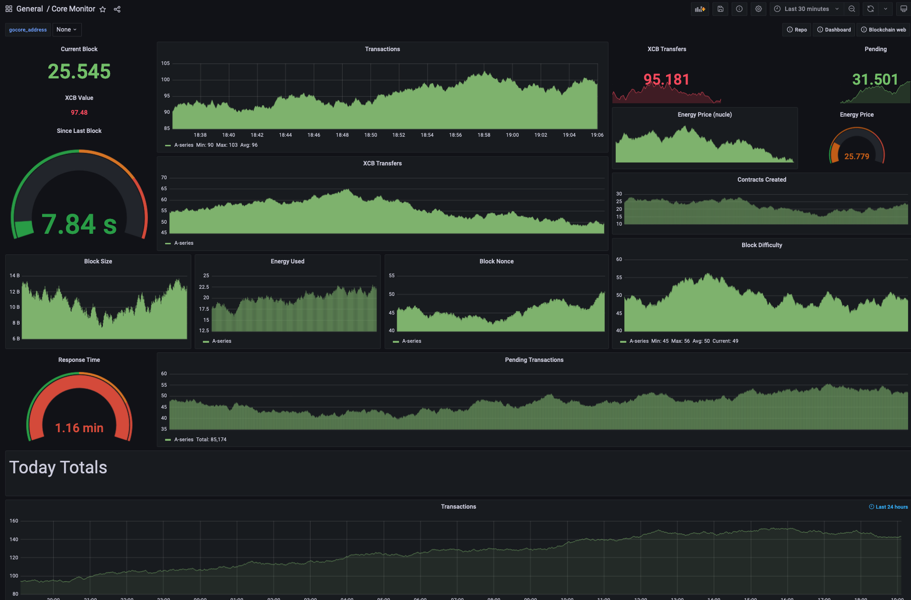

# Core Monitor

## Go-core Server Prometheus Exporter

[](docs/preview.png)

Monitor your Core Blockchain Go-core server with Prometheus and Grafana.

Visit the [Grafana Dashboard](https://grafana.com/dashboards/15957) to implement a go-core server monitor for your own server, or you can just import Dashboard ID: `15957` once you have Core Monitor up and running.

## Docker

Run this Prometheus Exporter in a [Docker container](Dockerfile). Include your Go-core server endpoint as `GOCORE` environment variable.

```bash
docker run -it -d -p 9090:9090 \
  -e "GOCORE="http://mygocoreserverhere.com:8545" \
  core-coin/core-monitor
```

## Features

- Current and Average Energy Price
- Total amount of CRC20 Token Transfers
- Total amount of XCB transactions
- Watch balance on specific addresses
- Pending Transaction count

## Environment Variables

You can add the environment variable `ADDRESSES` with a comma delimited list of Core Blockchain addresses.

- `GOCORE` = `http://xcb.mygocoreserver.com:8545` Core Blockchain node endpoint
- `ADDRESSES` = `cb406993957991426174f5a85456985b1c1c36591e89,cb90c2932989a1fb0accf660d960af031dffb68e447b`
- `DELAY` = `500` millisecond delay between requests

## Prometheus Response (example)

```
gocore_block 7042028
gocore_seconds_last_block 0.50
gocore_block_transactions 48
gocore_block_value 59.48321713266354
gocore_block_energy_used 1243863
gocore_block_energy_limit 8000000
gocore_block_nonce 7516583072599285197
gocore_block_difficulty 2606288773636567
gocore_block_uncles 0
gocore_block_size_bytes 6680
gocore_energy_price 2000000000
gocore_pending_transactions 136
gocore_network_id 1
gocore_contracts_created 0
gocore_token_transfers 10
gocore_xcb_transfers 35
gocore_load_time 0.5302
gocore_address_balance{address="cb406993957991426174f5a85456985b1c1c36591e89"} 86.99212193
gocore_address_nonce{address="cb90c2932989a1fb0accf660d960af031dffb68e447b"} 1
gocore_address_balance{address="cb600bfa7a2f85a2a207b5a22eec03822f8031afeed4"} 0.1605609476
gocore_address_nonce{address="cb047103a1cb2152742fab6d168abea324c64293894b"} 95623
```

## License

[CORE License](https://github.com/cryptohub-digital/core-license/blob/master/LICENSE)
